# Dream Content Platform

A revolutionary platform for capturing, analyzing, transforming, and trading dream content using advanced biometric sensing, artificial intelligence, and blockchain technologies.

## Overview

The Dream Content Platform is a groundbreaking system that bridges the gap between the subconscious mind and creative expression. By capturing high-resolution biometric data during sleep, the platform employs cutting-edge AI algorithms to analyze dreams and transform them into various forms of digital content, which can then be securely traded on a blockchain-powered marketplace.

This innovative approach opens up an entirely new dimension of creativity, tapping into the vast potential of the unconscious mind and enabling users to unlock, visualize, and monetize their dreams in ways that were previously impossible.

## Key Features

### 1. High-Resolution Sleep Data Collection

- **Advanced EEG Monitoring**: Captures brain activity at 1000Hz+ with 2+ channels
- **Comprehensive Biometric Data**: Records eye movements (EOG), heart rate variability (ECG), and respiratory patterns
- **Non-Invasive Technology**: Comfortable wearable devices designed for sleep
- **Real-Time Data Encryption**: Ensures data privacy and security
- **Precise Sleep Stage Detection**: Identifies REM sleep periods when most vivid dreams occur

### 2. AI-Powered Dream Analysis & Content Generation

- **Hybrid Neural Networks**: CNN-LSTM architecture for temporal pattern recognition in brain activity
- **Multi-Modal Content Generation**:
  - **Visual Art**: StyleGAN3 for dream imagery and scenes
  - **Narrative Text**: GPT-based language models for dream stories and descriptions
  - **Music Composition**: MIDI-based AI for dream-inspired soundtracks
- **Emotion Detection**: Captures the emotional tone and intensity of dreams
- **User Customization**: Allows refinement and direction of the generated content

### 3. Blockchain-Based Copyright Management

- **NFT Tokenization**: Transforms dream content into unique digital assets
- **Smart Contracts**: Automatically handles royalties and ownership rights
- **Ethereum Integration**: Leverages established blockchain infrastructure
- **Transparent Attribution**: Clear provenance tracking of dream-derived content

### 4. Dream Content Marketplace

- **Community Ecosystem**: Platform for creators and collectors of dream content
- **Intelligent Recommendation System**: Hybrid AI approach combining collaborative and content-based filtering
- **Multiple Content Categories**: Visual art, narratives, music, and multi-media experiences
- **Secure Trading**: Protected by blockchain verification

## Technology Stack

### Sleep Data Collection
- High-density EEG headbands or specialized sleep wearables
- Real-time data processing and edge computing
- Secure cloud storage for sleep data

### AI Processing
- TensorFlow/PyTorch implementation of CNN-LSTM networks
- StyleGAN3 for image generation
- GPT architecture for text generation
- Custom MIDI-based neural networks for music

### Blockchain
- Ethereum-based smart contracts
- ERC-721 NFT standard
- Decentralized storage solutions

### Platform Infrastructure
- Cloud-based processing for heavy computational tasks
- Mobile apps for user interaction
- Web portal for marketplace activities

## Use Cases

1. **Creative Inspiration**: Artists, writers, and musicians can tap into their unconscious creativity
2. **Digital Art Collection**: Unique dream-based NFTs for collectors
3. **Personal Insight**: Users can gain deeper understanding of their subconscious
4. **Scientific Research**: Valuable data for sleep science and consciousness studies
5. **Entertainment**: Immersive dream-based experiences

## System Architecture

The platform consists of five core modules:

1. **Sleep Data Collection Module (100)**: Captures and processes biometric data during sleep
2. **AI Analysis Module (200)**: Extracts dream content, emotions, and patterns from raw data
3. **AI Content Generation Module (300)**: Transforms dream analysis into various media forms
4. **Copyright Management Module (400)**: Handles NFT creation and intellectual property rights
5. **Marketplace Module (500)**: Facilitates the sharing and trading of dream content

These modules work together in a seamless pipeline from sleep data capture to content monetization, creating a complete ecosystem for dream-based creative expression.

## Implementation Examples

### Dream-Based Short Story Generation
- Collects REM sleep data via EEG headband
- AI identifies narrative elements, characters, settings
- GPT model generates 2,000-3,000 word short story
- Story is registered as NFT with appropriate attribution
- Available for purchase in marketplace

### Dream-Based Visual Art Creation
- Specialized sleep mask collects visual cortex activity
- StyleGAN3 transforms patterns into digital artwork
- User can refine and edit the generated imagery
- Artwork is minted as NFT with provenance tracking
- Displayed in virtual gallery for viewing and purchase

### Dream-Based Music Composition
- EEG-equipped earphones capture auditory brain activity during sleep
- AI analyzes emotional patterns and rhythmic elements
- Custom neural networks compose original musical pieces
- Multiple genre options based on dream characteristics
- Music NFTs can be streamed with royalties managed via smart contracts

## Getting Started

Detailed implementation guides are available in the `doc` directory:
- [System Requirements](doc/system_requirements.md)
- [Installation Guide](doc/installation.md)
- [Developer Documentation](doc/developer_docs.md)
- [User Guide](doc/user_guide.md)

## Related Research

A comprehensive collection of scientific papers related to sleep science, dream analysis, AI content generation, and blockchain technology can be found in the [Scientific_papers](Scientific_papers) directory.

Patent Pending
